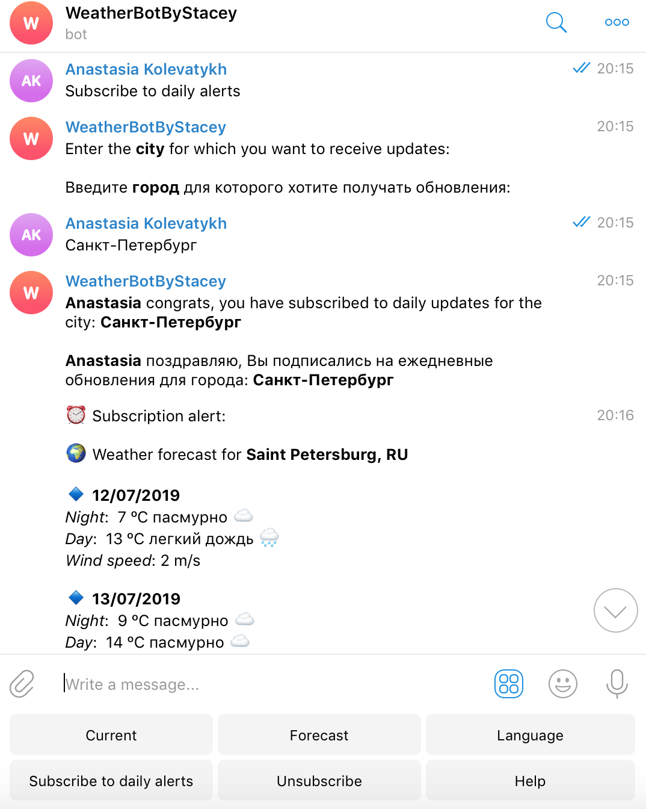

# weatherBot

Bot in telegram - @WeatherBotByStasey_bot

Bot sends current weather or forecast in response to user's city input.

Capabilities of the bot: 
- current weather;
- forecast;
- subscription to daily alerts (<b>TEST MODE</b>: alerts sent each 2 mins)

Main classes:
- MainClass: main method, enables the bot;
- AbilityMessageCodes: 4 modes to orepate on;
- TelegramBot: handles the conversation with users.

Bot consists of 4 packages:
- Alerts: sends alerts in a thread;
- Credentials: base class to access private api data;
- Database: saves users and used to access private SQLlite database data;
- Weather: fetches JSON weather data to send to Users, both Current state and Forecast.

Keyboard contains:
- Current: returns current weather state in response to city input.
- Forecast: gives weather data on 5 days ahead.
- Language: applied to weather description only.
- Subscribe to daily alerts: sends forecast once a day for the chosen city.
- Unsubscribe: cancel subscription.
- Help: gives a detailed description of the bot's options.
